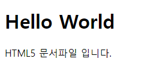

# 1. HTML5 
HTML(HyperText Markup Language)은 웹 페이지를 만들기 위한 [마크업](https://velog.io/@devp1023/%EB%A7%88%ED%81%AC%EC%97%85-%EC%96%B8%EC%96%B4%EB%9E%80) 언어입니다.  
웹 페이지의 내용(content)과 구조(structure)를 담당하는 언어로 <strong>HTML 태그</strong>를 이용해 정보를 구조화 합니다.  

{: width="70%" .align-center}

<br>

HTML5는 2014년 10월 28일 확정된 차세대 웹 표준으로 다양한 기능이 추가되었습니다.  

> **멀티미디어**  
플래시와 같은 플러그인의 도움 없이 비디오 및 오디오 기능을 자체적 지원한다.

> **그래픽**  
SVG, 캔버스를 사용한 2차원 그래픽과 CSS3, WEBGL을 사용한 3차원 그래픽을 지원한다.

> **통신**  
단방향 통신만 가능했던 기능을 양방향 통신이 가능하게 기능 구현 되었다.

> **오프라인 및 저장소**  
오프라인 상태에서도 애플리케이션을 동작할 수 있다. 이는 HTML5 플랫폼으로서 사용될 수 있음을 의미 합니다.

> **시맨틱 태그**  
HTML 요소의 의미를 명확히 설명하는 시맨틱 태그를 도입하여 브라우저, 검색엔진, 개발자 모두에게 콘텐츠의  
의미를 명확히 설명할 수 있다.

> **CSS3**  
HTML5는 CSS3를 완벽하게 지원 합니다.

<br>

# 2. HTML의 구동 방식
1) 개발자가 HTML 언어를 통해 코드를 작성하고 호스팅 서버에 전달.  
2) 서버는 도메인을 이용해서 웹 브라우저로 코드파일을 전달.  
3) 웹 브라우저는 전달받은 파일을 해석하여 클라이언트에게 컨텐츠 내용을 출력합니다.  


> HTML 파일이 웹 브라우저를 통해 해석되고 사용자들에게 보여지는 과정을 **렌더링**이라고 표현합니다.

<br>

# 3. HTML 문서 파일의 확장자
코드 파일에 HTML 언어를 작성하려면 파일의 확장자가 `.html` 이여야 합니다.  
**텍스트 편집기**인 `Visual Studio, Note Pad` 등을 사용해서 HTML 코드를 작성하고,  
**웹 브라우저** `Chrome, Firefox, IE` 등을 통해서 사용자에게 컨텐츠를 출력합니다.

<br>

# 4. HTML5 문서 기본 문법

```html
<!DOCTYPE html>
<html>
  <head>
    <meta charset="utf-8">
    <title>Hello World</title>
  </head>
  <body>
    <h1>Hello World</h1>
    <p>HTML5 문서파일 입니다.</p>
  </body>
</html>
```

{: .align-center}

* `!DOCTYPE html`은 해당 문서가 html5을 기반으로 작성되었다는 것을 의미합니다.  
언제나 문서의 최상단 부분에 위치해야 합니다.

* `html`은 html 문서에 사용되는 모든 태그들이 이 태그안에 포함됩니다.

* `head`는 웹 브라우저 화면상에는 표시되지 않지만, 브라우저가 필수로 알아야하는 정보들이 들어 있고,  
메타 태그나 페이지의 제목인 타이틀 태그가 이 태그에 포함됩니다.  
문서의 정보를 브라우저와 검색엔진에게 해당 문서가 어떤 정보를 포함하고 있는지 명시하기 위해 사용됩니다.

* `body`는 웹 페이지에 대한 모든 컨텐츠 정보를 포함하고 있는 태그 입니다.  
클라이언트가 육안으로 확인할 수 있는 정보들이 해당 태그에 포함됩니다.

<br>

# 5. HTML 요소
HTML 요소는 시작 태그와 닫힌 태그 사이에 존재하는 컨텐츠를 포함한 것을 요소라고 합니다.


태그는 대소문자를 구별하진 않지만 일반적으로는 소문자를 사용합니다.

<br>

## 5.1 요소의 중첩
요소 안에 요소를 포함시켜서 중첩할 수 있습니다. 이때 부자관계가 성립되며 이러한 관계로 정보를 구조화 합니다.

```html
<!DOCTYPE html>
<html>
  <head>
    <meta charset="utf-8">
  </head>
  <body>
    <h1>안녕하세요</h1>
    <p>반갑습니다!</p>
  </body>
</html>
```

{: .align-center}

`html` 요소는 `body` 요소를 포함하고, `body` 요소는 `h1`, `p` 요소를 포함하여 정보를 구조화 합니다.

<br>

## 5.2 빈 요소 (Empty Element)
내용(content)이 존재하지 않는 요소를 빈 요소라고 합니다. 컨텐츠를 필요로 하지 않는 요소들은 아래와 같습니다.  
빈 요소는 컨텐츠는 가질 수 없지만 속성(Attribute)는 가질 수 있습니다.

```html
<br>
<hr>

<input>
<link>
<meta> 등..
```

<br>

# 6. 속성(Attribute)
속성이란 요소에게 성질 및 특징을 부여해줍니다. 시작 태그에서 사용하며 속성의 개수는 제한이 없습니다.  
예를 들면 이미지 요소에 추가적인 정보, 파일의 경로 및 크기등을 속성을 통해서 정의할 수 있습니다.

```html

     속성    속성 값
```

<br>

# 7. 주석(Comments)
개발자에게 코드를 설명하기 위해서 사용되며, 웹 페이지에 출력되지 않습니다.

```html
<!-- 주석 이기에 출력되지 않는다 -->
이 부분만 출력 됩니다.
```

{: .align-center}

